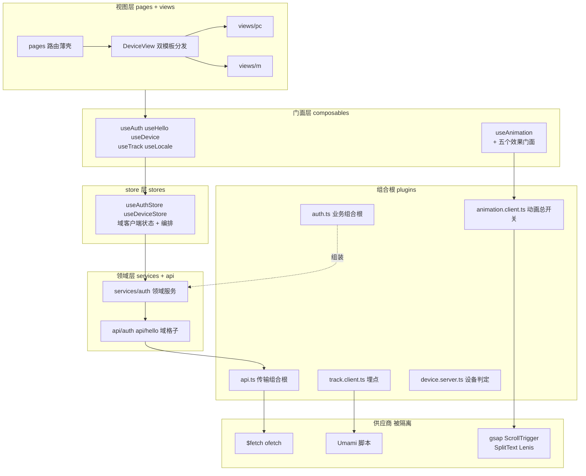
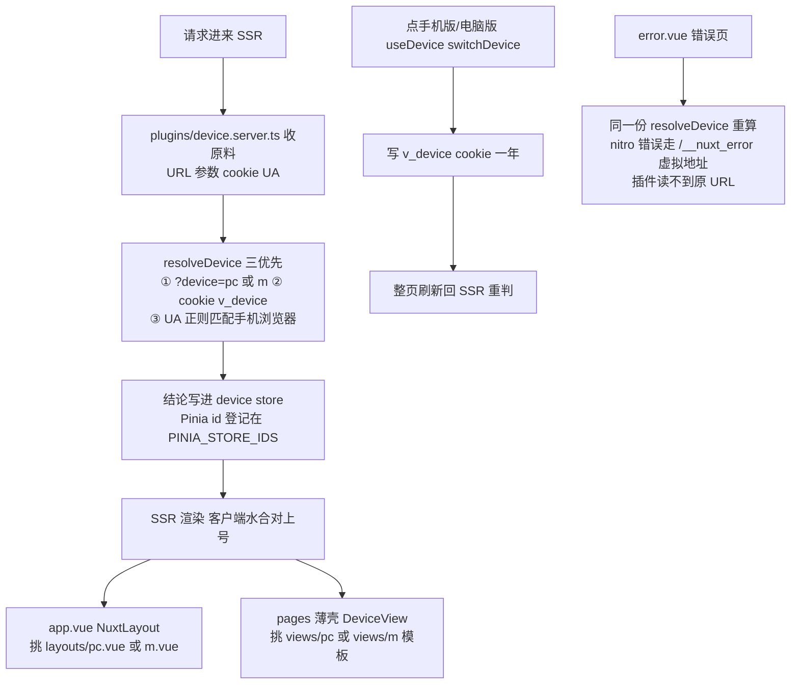
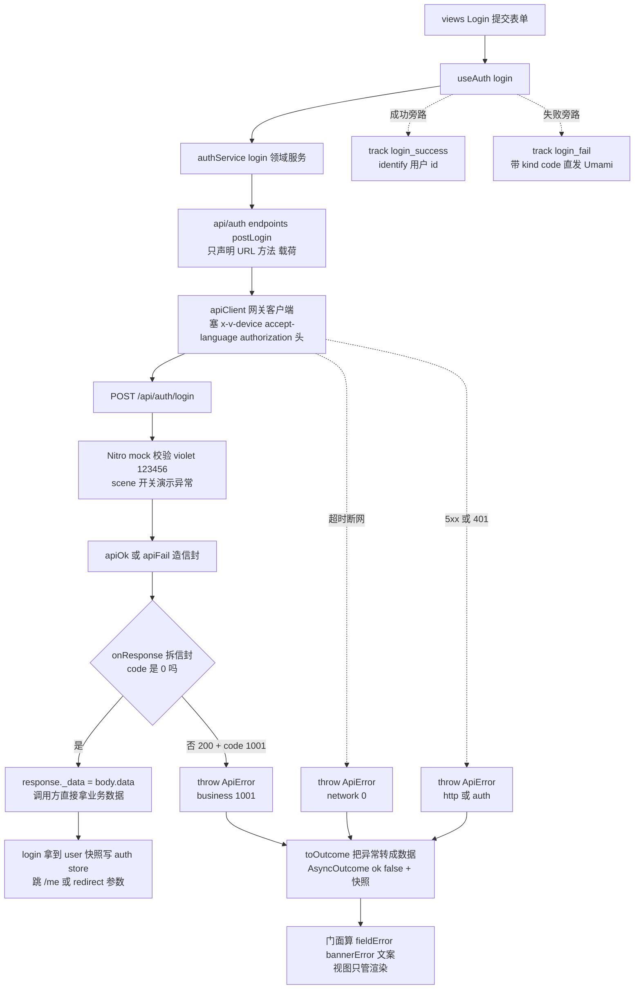

# Violet 前端（violet-vue3-nuxt）

    

Violet 的 C 端站点，**Nuxt 4 全栈单体**：`app/` 管前端，`server/` 是 Nitro mock 后端（登录、会话、示例接口）。

现在是骨架期，但骨架是全的：五个页面（首页 / 关于 / 动效示范 / 登录 / 我的）、pc / m 双端自适应（一个 URL，服务端按设备渲染 pc 或 m 整棵树，不做两套站点）、中英双语、埋点、动画栈都已就位，业务往这套骨架上长。接真实后端时改 `apiBase` 指向真网关、拔掉 mock 和 `MockScene` 演示开关即可。

三条纪律贯穿全文，先立个印象，细节在各章展开：

- **分层**：视图只调门面，门面包领域服务，领域服务经组合根注入依赖；供应商（gsap、Umami、ofetch）被隔离在最底层两处文件里
- **登记**：键名、事件名、样式 token 先登记再使用，别处不写字面量
- **错误**：错误以数据形态过 SSR，错误码到文案两级收口

> 💡 **新人路线**：快速开始 → 名词对照表 → 分层架构，读完这三处就能上手改代码；其余章节当手册按需查。

> 🤖 **AI / Agent 编码**：入口是 `AGENTS.md`（业务接入流程 + 硬约束速查），规则集在 `docs/conventions/`（面向 AI 的编码规范，canonical）；本 README 讲 why 与快速开始，面向人类阅读。

全文黑话不多，先对齐——大白话对照表：

| 名词 | 大白话 |
|---|---|
| 组合根 | 装配点。把零件造好、接好线再往下发的那个地方，本项目的 `plugins/` |
| 门面 | 正式门口。外面只找门口办事，不进屋翻抽屉，`composables/` 里一个个 `useXxx` |
| 登记册 | 全项目只有一份的花名册。键名、事件名、样式 token 都先登记再使用，别处不许写字面量 |
| 域格子 | 一个业务域一个文件夹格子，东西收在格子里，对外只开 `index.ts` 一个口 |
| 域 store | 一个业务域一份客户端状态（`app/stores/<域>.ts`），Pinia 管理；服务端数据不进 store，持久化按 store 配置 pick 字段 |
| 双模板 | 同一路由备 pc 和 m 两套模板，按设备现场挑一套渲染 |
| 水合 | hydration。服务端先吐 HTML，浏览器里 Vue 再把状态对上号、接管交互 |
| 信封 | 后端统一响应外壳 `{ code, message, traceId, data }`，业务数据装在 `data` 里 |

## 目录

- [🚀 快速开始](#-快速开始)
- [🧭 技术选型与理由](#-技术选型与理由)
- [🏗️ 分层架构与各层职责](#-分层架构与各层职责)
- [📁 目录结构](#-目录结构)
- [🔄 数据流设计](#-数据流设计)
  - [登录全链路](#登录全链路)
  - [hello 域对照](#hello-域对照)
- [🎨 样式搭建](#-样式搭建)
- [🔌 API 搭建](#-api-搭建)
- [🧱 业务分层判定](#-业务分层判定)
- [🎬 动画栈](#-动画栈)
- [🚨 错误体系](#-错误体系)
- [✅ 质量门禁与验证](#-质量门禁与验证)

---

## 🚀 快速开始

环境要求只有一条：Node 22（`.nvmrc` 钉在 22.16.0），包管理用 npm。

```bash
nvm use          # 切到 Node 22
npm install      # postinstall 自动跑 nuxt prepare
npm run dev      # 开发服务器，默认 http://localhost:3000
```

测试：`npm run test`（Vitest 纯逻辑层）、`npm run test:e2e`（Playwright 关键旅程，首次先 `npx playwright install chromium`）；分层与放置约定见 `docs/conventions/testing.md`。

起来后用演示账号登录：`violet / 123456`（mock 登录接口写死的，见 `server/api/auth/login.post.ts`）。

**埋点（可选）**：不配也能跑，整个埋点栈静默 no-op，业务调用处零防御。

```bash
cd deploy/umami && docker compose up -d
# 打开 http://127.0.0.1:8300，建站 violet-dev，把 Website ID 抄进 .env
```

`.env` 照 `.env.example` 配两个变量：`NUXT_PUBLIC_UMAMI_HOST_URL=http://127.0.0.1:8300`、`NUXT_PUBLIC_UMAMI_WEBSITE_ID=<后台的 Website ID>`。事件名只有 `constants/track.ts` 登记册一份，想知道某个动作在报表里叫什么只查它。

---

## 🧭 技术选型与理由

| 依赖 | 版本 | 为什么 |
|---|---|---|
| nuxt + vue | ^4.5.2 / ^3.5.43 | 一个仓库同时管前端和 Nitro 后端；`shared/` 目录让两端共用一套类型；`app/` 目录与 auto-import 少写一堆模板代码 |
| tailwindcss | ^4.3.3（@tailwindcss/vite） | v4 是 CSS-first，没有 tailwind.config，token 直接在 `tokens.css` 登记 |
| shadcn-nuxt + reka-ui | ^2.8.2 / ^2.10.5 | shadcn 是拷贝制不是装包：组件代码进 `components/ui/`，想改当场改；`Ui` 前缀注册，new-york 风格、neutral 色板（`components.json`） |
| @nuxtjs/i18n | ^10.6.0 | `strategy: 'no_prefix'`：URL 不带语言前缀，路由表干净；中英互切靠 cookie `v_locale` 记忆 |
| @nuxt/scripts + Umami | ^1.3.12 | 第三方脚本走注册表加载（`useScriptUmamiAnalytics`），PV 由 Umami v3 脚本自己采集；数据在自托管 Docker 里 |
| @nuxt/fonts | ^0.14.0 | 只待命不动事：所有网络 provider 全禁了，全站系统字体栈，构建期不去外网探测 |
| @nuxt/image / @vueuse/nuxt | ^2.1.0 / ^15.0.0 | 图片优化与工具组合式，按需用 |
| pinia + @pinia/nuxt + pinia-plugin-persistedstate | ^4.0.3 / ^1.0.2 / ^4.7.1 | 复杂业务的客户端状态容器：一域一 store，视图经门面消费；持久化是配置不是散落的手写同步（localStorage，全局键模板 `violet:%id`） |
| gsap + lenis + lottie-web | ^3.15.0 / ^1.3.26 / ^5.13.0 | 动画三件，详见「🎬 动画栈」 |

动画库为什么全走 npm 本地打包、不走 CDN：`@nuxt/scripts` 注册表里没有这三家的条目，CDN 引入就脱离版本管理。npm 安装后版本锁在 lockfile，离线也能构建，typecheck 摸得到类型；lottie 还只在播放器里动态 import light 构建，首屏不背这个体积。

Node 22（`.nvmrc` 钉在 22.16.0），包管理用 npm，没有其他全局要求。

---

## 🏗️ 分层架构与各层职责



各层职责，从上往下依赖，禁止反向：

1. 视图层（`pages/` + `views/` + `layouts/`）：每个路由一个薄壳文件，只做双模板分发和 SEO 元信息；真正的页面长在 `views/pc/`、`views/m/`。视图不许发请求、不许碰全局状态、不许 import 动画库。
2. 门面层（`composables/`）：每个业务域一个门口。视图和别的域只找门口，域内实现随便改不影响外面。
3. store 层（`stores/`）：域的客户端状态与业务结果编排；调组合根注入的服务，不 import services 文件；业务规则仍在 services；服务端数据（useAsyncData 缓存）不进 store。
4. 领域层（`services/` + `api/`）：业务规则（token 什么时候清）和契约（URL、载荷、错误码）。依赖全部从参数注入，能在单测里拿桩直接 new 出来用。
5. 组合根（`plugins/`）：装配点。`api.ts` 造带凭据的请求客户端，`auth.ts` 拿它组装会话服务，`animation.client.ts` 接好 GSAP 和 Lenis 再统一发下去。
6. 供应商：gsap、Lenis、lottie、Umami、ofetch。只许组合根和对应门面碰，换供应商只动这两处。

依赖方向的硬约束不在嘴上，在 eslint 里（「✅ 质量门禁与验证」）：视图层直连 `$fetch`、值导入 `api/`、直连 Pinia store、直写 `useState`、import 动画库，保存文件那一刻就报错。

双模板怎么分发——设备自适应判定流（判定算法只写一份，在 `utils/device.ts` 的 `resolveDevice`）：



手动切端不做实时换模板：写 cookie 后整页刷新，让服务端重新判一遍，最省事也最不容易出两端状态不一致。

---

## 📁 目录结构

```text
.
├── app/                       # 应用主体（Nuxt 4 的 app/ 目录）
│   ├── app.vue                # 根组件：按设备挑布局 + 标题模板「xx · Violet」
│   ├── error.vue              # 全局错误页薄壳：双模板分发 + 设备重判
│   ├── router.options.ts      # 路由滚动接管（Lenis 优先，降级回落原生）
│   ├── assets/css/            # main.css 装配 / tokens.css 登记册 / base.css 基线
│   ├── constants/             # 登记册：键名 keys.ts、埋点事件名 track.ts
│   ├── middleware/auth.ts     # 受保护路由门卫，未登录踢去 /login 并带 redirect
│   ├── plugins/               # 组合根：api / auth / device.server / track.client / animation.client
│   ├── composables/           # 门面层：useAuth、useApi、useTrack、useDevice、useLocale、usePageMeta、useHello
│   │   └── animation/         # 动画域文件夹：useAnimation + 五个效果门面，经 index.ts 再导出
│   ├── stores/               # Pinia 域 store：auth（含 localStorage 持久化示范）、device
│   ├── api/                   # 域格子：auth/、hello/（契约+接口+错误码）+ error.ts 公共错误件
│   ├── services/              # 领域服务：auth/（业务规则，依赖全注入）+ types.ts 跨域端口
│   ├── utils/                 # 纯函数：cn（类名合并）、device（设备判定算法）
│   ├── pages/                 # 路由薄壳：index / login / me / about / animation
│   ├── views/                 # 真正的页面模板：pc/ 与 m/ 两套，各自演进
│   ├── layouts/               # 双端布局壳 pc.vue / m.vue：导航 + 切语言 + 切端
│   └── components/
│       ├── ui/                # shadcn 拷贝制组件（Ui 前缀，业务无感）
│       ├── basic/             # 通用原子件：common/ 下 LottiePlayer、VideoPlayer（业务无感）
│       └── business/          # 业务组件：common/DeviceView 双模板分发；pc/、m/ 留位待用
├── server/
│   ├── api/                   # Nitro mock：hello、auth（登录 / 会话 / 登出）
│   └── utils/envelope.ts      # 信封工厂 apiOk / apiFail
├── shared/types/              # 跨端纯类型：信封、错误形状、AsyncOutcome、Device
├── i18n/locales/              # zh.json / en.json
├── public/demo/               # URL 引用型静态资源（video src 这类，不进打包）
├── deploy/umami/              # Umami 本地栈 docker-compose
├── eslint.config.mjs          # 五个配置块：全站公共 + 四块分层门禁
├── nuxt.config.ts             # 模块序 / i18n / runtimeConfig / nitro Vary 头
├── components.json            # shadcn 配置
├── .env.example               # Umami 两个环境变量
└── .nvmrc                     # 22.16.0
```

---

## 🔄 数据流设计

### 登录全链路



按顺序读：

1. 视图（`views/pc/LoginPage.vue`）只调 `useAuth().login(payload, scene)`，表单和 `MockScene` 演示开关留在视图。
2. `useAuth`（门面）调 auth 域 store（`useAuthStore().login`）：store 负责状态（pending/error/user 快照）与业务结果，经 `useNuxtApp` 调组合根注入的 `$authService.login`。领域服务拿到 token 就经 `TokenStorage` 端口写 cookie，返回 user——它不知道 HTTP 细节，cookie 实现在 `plugins/api.ts`。
3. 领域服务调 `api/auth/endpoints.ts` 的 `postLogin`：只声明 URL / 方法 / 载荷 / 类型，client 是参数传进来的。
4. client 由 `useApi` 造（`$fetch.create`）：每个请求动态塞 `x-v-device`、`accept-language`、`authorization` 头，超时 10 秒。
5. Nitro mock（`server/api/auth/login.post.ts`）校验账号；`scene` 开关模拟异常路径：`timeout` 吊 30 秒让客户端 10 秒超时先到（network 类）、`http500` 直接抛 5xx（http 类）、密码错返回 200 + `code 1001`（business 类）。
6. 响应回来先过信封：`code === 0` 就把 `body.data` 直接赋给 `response._data`，调用方拿到的就是业务数据；`code !== 0` 抛 `ApiError('business', code)`。
7. 异常再经 `toOutcome` 转成 `AsyncOutcome` 数据（错误必须以可序列化的快照形态过 SSR，原因见「🚨 错误体系」）。
8. 门面按快照算两级文案（「🔌 API 搭建」），视图只管渲染 `fieldError` / `bannerError`。埋点 `track` / `identify` 是旁路：直发 Umami，不搅主链路；登录成功后的跳转优先用守卫带来的 `redirect`，只认站内路径（正则拦开放重定向）。

### hello 域对照

hello 是最小业务域，对照着看 api 域格子四件套范式（`api/<domain>/{index,contracts,endpoints,errors}.ts`）：

| 文件 | 职责 | auth 域 | hello 域 |
|---|---|---|---|
| `contracts.ts` | 契约：入参、返回、业务错误码联合 | `LoginPayload`、`AuthUser`、`AuthErrorCode` | `HelloResult` |
| `endpoints.ts` | 接口：只声明 URL / 方法 / 类型，零逻辑 | `postLogin` / `getMe` / `postLogout` | `getHello` |
| `errors.ts` | 业务码到 i18n key 的登记表 | `1001 → error.1001` | 无（没有业务码，出码再补） |
| `index.ts` | 域门面：对外唯一出口，域内文件不许被伸进 | 有 | 有 |

hello 没有业务规则，所以也没有 `services/hello/` 格子——service 层不是每域必备，有跨接口的状态规则才建。视图层禁值导入 `api/` 后的合规消费位是门面：

```ts
export function useHello() {
  const api = useApiClient()
  return useAsyncData<HelloResult>('hello:message', () => getHello(api))
}
```

`useAsyncData` 的 key 走域前缀制（`域:实体`，对齐 `auth:me`），pc / m 双端共用这一份，URL 和类型不用两端各抄一遍。

---

## 🎨 样式搭建

- `main.css` 是唯一入口（nuxt.config 的 `css` 数组只指向它），装配顺序：`tailwindcss` → `tw-animate-css` → `lenis/dist/lenis.css`（平滑滚动官方修正）→ `tokens.css` → `base.css`。
- `tokens.css` 是 token 登记册：全站唯一样式出处。制度是新 token 先登记再使用，只登记有人用的，设计没定下来的不预先登记。`:root` 放 CSS 变量，`@theme inline` 把它们映射成 Tailwind 工具类（`--primary → text-primary` 这类）。以后 Dialog / Popover / 暗色模式按需补登记。
- `base.css` 是全局基线：元素默认值 + 页面切换过渡（`pageTransition` 作用在页面组件包裹层，所以必须写全局）。
- scoped 纪律：分端布局样式在 `layouts/pc.vue`、`m.vue` 的 `<style scoped>` 里，视图样式在各视图 SFC 里；全局只留 token 和基线，谁也不许往全局塞业务样式。
- 静态资源二分：要进打包的走 `app/assets/` import；用 URL 引用的（video src、lottie path）放 `public/<域>/`。

---

## 🔌 API 搭建

信封是后端网关统一响应外壳，契约在 `shared/types/api.ts`，两端共用：

```ts
interface ApiEnvelope<T = unknown> {
  code: number      // 0 = 成功，非 0 = 业务错误码
  message?: string  // 给日志看的英文描述，不直接给用户
  traceId?: string  // 排查用
  data: T           // 真正的业务数据
}
```

server 侧造信封只有 `server/utils/envelope.ts` 一个地方（`apiOk` / `apiFail`），字段增删只改这里；app 侧拆信封只有 `useApi` 的 `onResponse` 一处。

`useApi` 造的网关客户端管三件事：

1. 动态塞头：设备（`x-v-device`）、语言（`accept-language`）、凭据（`authorization: Bearer`）。token / locale 由组合根用 Ref 传进来，本层不管它们从哪来。
2. 拆信封：见上。
3. 错误归一化：不管原始错误长什么样，上层永远只见四种 `ApiErrorKind`——`network`（超时断网）/ `http`（5xx）/ `business`（200 + 业务码）/ `auth`（401 会话失效）。全站唯一的错误形状，哪个域都不许发明第五种。

错误文案分两级收口，双端视图零重复：

- 字段级：业务码命中域错误表 `AUTH_ERROR_I18N`（`{ 1001: 'error.1001' }`）就有文案，展示在输入框下面（比如「用户名或密码错误」）。`satisfies` 穷尽检查保证 contracts 里扩了码、errors 里漏了译，编译就过不去。
- 横幅级：按错误形状查全站表 `API_ERROR_BANNER_I18N`（网络异常 / 服务开小差了）；业务码在字段级没登记到就兜底 `error.fallback`。

---

## 🧱 业务分层判定

新组件放哪，四连问按顺序判（登记在 eslint 的 ui/basic 门禁头注里）：

1. shadcn 拷贝？→ `components/ui/`
2. 通用无感的原子件（播放器这类不含业务）？→ `components/basic/common/`
3. 跨端复用的业务组件？→ `components/business/common/`
4. 单端业务组件？→ `components/business/<pc|m>/<域>/`

组件名 = 路径前缀制：`business/pc/product/Gallery.vue` 自动导入名 `BusinessPcProductGallery`。ui 和 basic 是业务无感层：文案、状态全从 props 传进来，禁依赖 composables / api / services / constants，禁 import business（低层不许依赖高层）。

composables 域化触发线（登记在 `composables/animation/index.ts`）：

- 单目录超过 15 个文件，或某域门面攒到 3 个以上 → 建域文件夹 + `index.ts` 再导出。
- 单文件域（比如 `useAuth`）留在顶层；跨域横切门面（`useApi` / `useTrack` / `useDevice` / `useLocale` / `usePageMeta`）永远顶层。
- 不为「将来可能有」预建空域文件夹。

类型三级归属（登记在 `shared/types/api.ts` 头部）：

1. 域私有 → 域自己的 `contracts.ts`（如 `api/auth/contracts.ts`）。
2. app 内分层抽象 → `services/types.ts`（跨域端口，如 `ApiClient`）或该域 `services/<domain>/contracts.ts`。
3. 跨端公共：app 和 server 都要用，或 3 个以上域用 → `shared/types/`。提升要记账（文件头登记谁在用），防这里变类型垃圾场。

---

## 🎬 动画栈

一个底层门面 + 五个效果门面 + 两个播放器：

| 门面 | 标记 | 干什么 |
|---|---|---|
| `useAnimation` | — | 底层访问口，直返组合根发下来的 `{ gsap, lenis, reduced }` |
| `useReveal` | `data-reveal` | 滚动显现：进视口从下往上淡入（`y:24`，`top 85%` 触发） |
| `useHeroTimeline` | `data-hero` | 首屏进场：挂载就播，按 DOM 顺序 stagger 浮现 |
| `useSplitText` | `data-split` | 逐字 / 逐词入场（SplitText 拆字） |
| `useParallax` | `data-parallax="120"` | 视差：标记值是振幅，scrub 模式滚多少动多少 |
| `usePinnedSection` | `data-step` | 钉住叙事：整节钉在视口，滚动驱动步骤切换 |

用法就三行，视图永远不 import 动画库：

```vue
<script setup lang="ts">
const root = ref<HTMLElement | null>(null)
useReveal(root)
</script>

<template>
  <section ref="root">
    <h1 data-reveal>标题</h1>
  </section>
</template>
```

- 组合根 `plugins/animation.client.ts` 只在浏览器跑：注册 ScrollTrigger / SplitText，Lenis 关掉自己的动画循环（`autoRaf: false`）交给 gsap ticker 带着走——整页只有一个 rAF 循环，动画和滚动永远同拍（接法照抄 Lenis 官方 GSAP 配方）。`page:finish` 时 `ScrollTrigger.refresh()` 重算换页后迟到的布局。
- 降级是第一公民：用户开了「减弱动态效果」（prefers-reduced-motion）时 `lenis` 是 null、所有效果门面直接 return，元素天然可见，零内联样式。
- 两个播放器都在 basic 层、业务无感：`LottiePlayer` 动态 import light 构建（体积约半，传对象时深拷贝防 lottie 就地改写常量），`VideoPlayer` 原生 video；共用一个套路——进视口播、出视口停，看不见不浪费帧，卸载时 destroy / disconnect。
- `/animation` 是示范页（`views/pc/AnimationDemoPage.vue`）：每一节配一个效果门面，要动效的元素打标记进舞台。
- 路由滚动被 `router.options.ts` 接管：只要 Lenis 在，切页滚动全走 `lenis.scrollTo`（vue-router 自带的 window.scrollTo 会和 Lenis 抢位置）；时序照抄 Nuxt 默认实现，滚前先 `lenis.resize()` 同步 limit，防还原位被旧缓存钳掉。降级时回落原生位置语义。

---

## 🚨 错误体系

- 运行时错误类 `ApiError`（`app/api/error.ts`）：`kind` / `code` / `traceId` 三字段，只在 `useApi` 拦截器里生产。以后接 Sentry 之类的上报，在这个文件里长。
- 错误必须以数据形态过 SSR：`useAsyncData` 会把回调抛的异常包成 H3Error，自定义类的字段会丢（Nuxt 源码行为）。所以各域统一走 `toOutcome()` 把异常转成 `AsyncOutcome`——`{ ok: true, data }` 或 `{ ok: false, error: ApiErrorSnapshot }`，快照只留可序列化字段，放进 store / useAsyncData 才安全。
- `error.vue` 是全局错误页薄壳：用和 pages 一样的双模板分发姿势按设备挑 pc / m 模板。设备判定在这里重算一遍——nitro 层错误（404 等）经内部虚拟地址 `/__nuxt_error` 渲染，device 插件读不到原始 URL 的 device 参数；判定算法仍是同一份 `resolveDevice`，只是这层自己收原料。
- 视图消费范式：登录页读 `fieldError` / `bannerError`（文案已在门面算好）；`/me` 页按 `AsyncOutcome` 分支渲染——成功显示用户，`kind === 'auth'` 显示会话过期 + 去登录，其余显示通用错误。

---

## ✅ 质量门禁与验证

改动提交前跑三连，0 error 才算过：

```bash
npm run typecheck   # vue-tsc 全量类型检查
npx eslint .        # lint 门禁（package.json 没配 lint script，直接 npx）
npm run build       # 生产构建
```

### eslint 分层门禁

`eslint.config.mjs` 五个配置块：一块全站公共（暂空占位）+ 四块分层门禁：

| 门禁块 | 管谁 | 拦什么 |
|---|---|---|
| 视图层 | `app/views/` `app/pages/` | 直连 `$fetch`；值导入 `~/api/*` `~/services/*` `~/stores/*`（type 导入放行）；直写 `useState`；import gsap / lenis / lottie-web |
| 公共类型层 | `shared/types/` | 导出任何运行时东西（const / function / class），只准纯类型 |
| 常量层 | `app/constants/` | 导出函数或类——函数归 utils，有状态逻辑归 composables |
| 无感组件层 | `components/ui/` `components/basic/` | 依赖 composables / api / services / constants / stores，import business |

> ⚠️ **已知局限**（eslint 头注里也写了）：Nuxt auto-import 绕过 import 检查，`ui` / `basic` 层直接调 `useAuth` 这类只能靠 code review 兜底。

### 手工验证清单

- **登录流**：错误密码看字段文案，正确密码跳 `/me`，Umami 落 `login_success`；登录页 `scene` 下拉模拟服务端 500 / 请求超时；`/me?scene=expired` 模拟会话过期
- **动效**：`/about` 看滚动显现和 Lottie；`/animation` 看全部效果门面
- **双端**：导航栏切「手机版 / 电脑版」看双模板分发
- **降级**：DevTools 开「Emulate CSS prefers-reduced-motion」刷新，确认全站降级为原生滚动零动画
